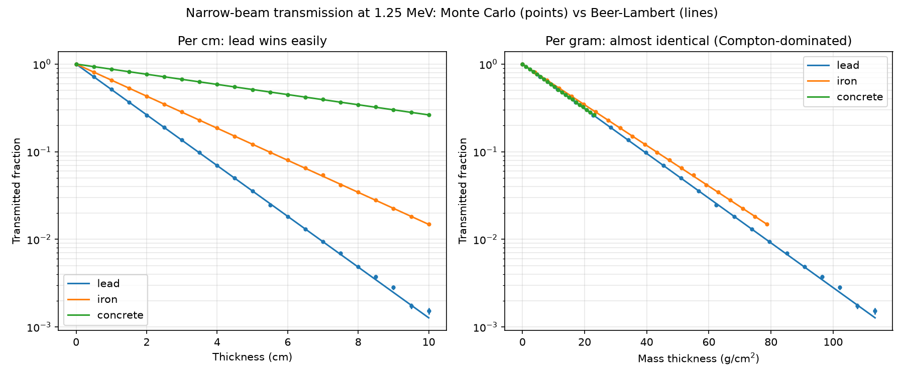
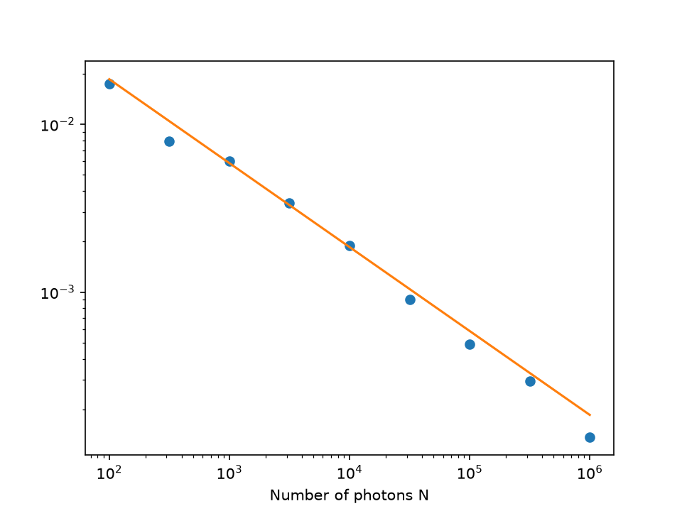
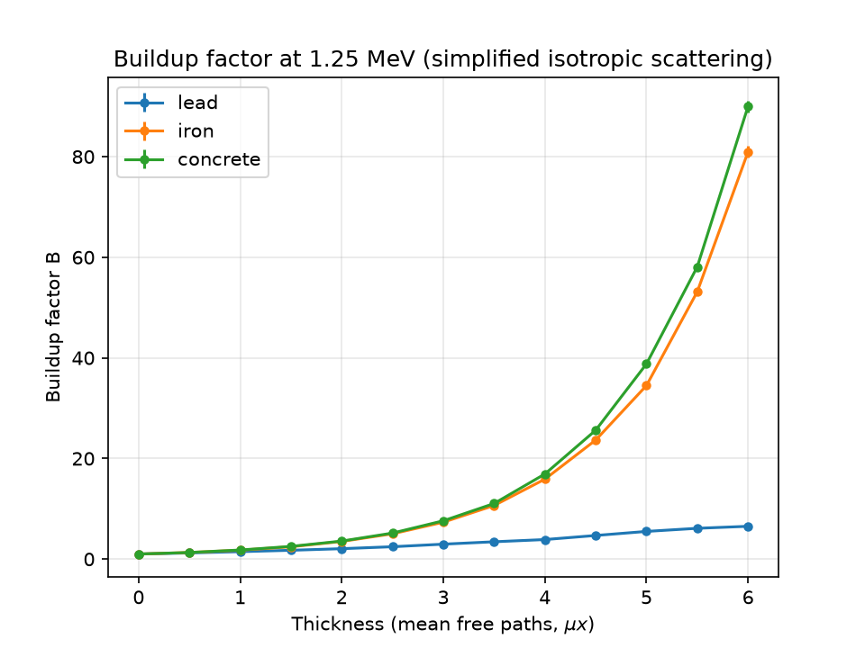

# Monte Carlo Radiation Shielding Simulation

# Monte Carlo Radiation Shielding Simulation

A Monte Carlo photon transport simulation for gamma-ray shielding at 1.25 MeV (roughly Co-60), comparing lead, iron and concrete. Attenuation data is from NIST XCOM.

## What it does

1. **Narrow-beam transmission** – fires photons into a slab and counts how many get through without interacting. Validated against the Beer–Lambert law.
2. **Convergence study** – checks that the Monte Carlo error falls as 1/√N, as expected.
3. **Scattering and buildup** – tracks each photon through repeated scattering events until it's transmitted, reflected or absorbed, and calculates the buildup factor (how much more gets through than Beer–Lambert predicts).

## Method

The distance a photon travels before interacting is sampled as s = −ln(U)/μ, where U is uniform on (0, 1] and μ is the linear attenuation coefficient (mass attenuation coefficient × density). At each interaction the photon scatters with probability (coherent + incoherent)/total, otherwise it's absorbed.

| Material | Density (g/cm³) | μ (cm⁻¹) | Mean free path (cm) | Scatter probability |
|---|---|---|---|---|
| Lead | 11.35 | 0.667 | 1.50 | 0.80 |
| Iron | 7.874 | 0.421 | 2.37 | 0.99 |
| Concrete | 2.3 | 0.134 | 7.49 | 0.99 |

## Results

### Validation against Beer–Lambert

The simulation matches Beer–Lambert across three orders of magnitude. Per cm, lead is by far the best shield, but per gram (right panel) all three are nearly identical, because at 1.25 MeV attenuation is dominated by Compton scattering, which depends on electrons per gram. Lead's advantage is mostly density. It sits slightly lower than iron per gram because of extra photoelectric absorption from its high atomic number.

### Convergence

The RMS error falls with a fitted slope of −0.52, against the theoretical −0.5 for Monte Carlo (1/√N).

### Buildup factor

Once scattering is included, more photons get through than Beer–Lambert predicts. At 6 mean free paths the buildup factor is about 7 for lead but around 80–90 for iron and concrete. Iron and concrete scatter about 99% of the time, so photons bounce around and eventually leak through, while lead absorbs about 20% of the time and removes scattered photons much faster.

## Limitations

This is a simplified model:
- **Scattering is isotropic and photons don't lose energy.** Real Compton scattering is forward-peaked and each scatter lowers the photon's energy, which makes it much more likely to be absorbed. Because of this, the buildup factors here are significantly larger than published values, especially for iron and concrete. The trend (low-Z materials having much larger buildup than lead) is correct, but the magnitudes aren't.
- One energy only (1.25 MeV) and an infinite slab geometry.

## Next steps

- Add Compton energy loss using the Klein–Nishina formula with energy-dependent attenuation coefficients from XCOM
- Compare buildup factors against published reference data
- Extend to a range of photon energies

## Files

- `materials.py` – NIST XCOM attenuation data
- `narrow_beam.py` – narrow-beam simulation and Beer–Lambert validation
- `convergence.py` – Monte Carlo error vs number of photons
- `scattering.py` – scattering model and buildup factor

## How to run

Requires Python 3 with NumPy and Matplotlib.

    py narrow_beam.py
    py convergence.py
    py scattering.py